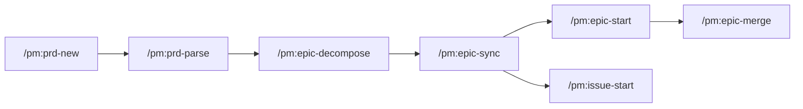

# PM — 精简项目管理系统

基于 Spec-Driven Development、MIT 6.031 软件工程原则和 Agent Teams 的 Claude Code 项目管理系统。

## 设计哲学

- **规范驱动**：每行代码都追溯到需求规范
- **6.031 原则**：远离缺陷 / 易于理解 / 适应变化
- **Agent Teams**：多 Agent 并行协作，取代 worktree + subagent 模式
- **本地优先**：所有操作先在本地文件，按需同步 GitHub
- **FSEvent 友好**：标准化 Frontmatter 便于外部工具实时监控进度

## 工作流程

```
PRD → Epic → Tasks → GitHub → Agent Team → Merge
```



## 7 个核心命令

| 命令 | 说明 | 输入 → 输出 |
|------|------|------------|
| `/pm:prd-new` | 头脑风暴创建 PRD | 对话 → `.claude/prds/{name}.md` |
| `/pm:prd-parse` | PRD 转化为技术 Epic | PRD → `.claude/epics/{name}/epic.md` |
| `/pm:epic-decompose` | Epic 拆分为具体任务 | Epic → `.claude/epics/{name}/*.md` |
| `/pm:epic-sync` | 推送到 GitHub Issues | 本地文件 → GitHub Issues |
| `/pm:epic-start` | 启动 Agent Team 并行执行 | Tasks → Agent Team |
| `/pm:issue-start` | 处理单个 Issue | Issue → 代码实现 |
| `/pm:epic-merge` | 合并到 main 分支 | Epic 分支 → main |

## 文件约定

```
.claude/
├── prds/                     # PRD 文件
│   └── {feature-name}.md
├── epics/                    # Epic 和任务文件
│   ├── {feature-name}/
│   │   ├── epic.md           # 技术实现计划
│   │   ├── 001.md            # 任务（sync 后重命名为 Issue 编号）
│   │   ├── 002.md
│   │   └── github-mapping.md # Issue 映射
│   └── archived/             # 已归档 Epic
```

### Frontmatter 示例

每个文件都有 `type` 字段标识类型，`status` 字段追踪进度：

```yaml
# PRD
---
type: prd
name: feature-name
description: "功能简述"
status: backlog          # backlog → in-progress → done
created: 2026-02-07T12:00:00Z
---

# Epic
---
type: epic
name: feature-name
status: backlog
prd: .claude/prds/feature-name.md
github: ""               # sync 后填充
task_count: 0
tasks_done: 0
---

# Task
---
type: task
name: "任务标题"
status: open             # open → in-progress → done
depends_on: []
parallel: true
---
```

## 安装

将 `pm/` 目录复制到你的项目的 `.claude/` 目录下：

```bash
# 克隆仓库
git clone https://github.com/automazeio/pm.git /tmp/pm-install

# 复制到你的项目
cp -r /tmp/pm-install/pm/ /path/to/your/project/.claude/

# 清理
rm -rf /tmp/pm-install
```

### 前提条件

- [Claude Code](https://docs.anthropic.com/en/docs/claude-code) CLI
- [GitHub CLI](https://cli.github.com/) (`gh`)
- 可选：[gh-sub-issue](https://github.com/yahsan2/gh-sub-issue) 扩展

### 启用 Agent Teams

PM 的并行执行功能依赖 Agent Teams。启用方法：

```bash
# 方法 1：环境变量
export CLAUDE_CODE_EXPERIMENTAL_AGENT_TEAMS=1

# 方法 2：settings.json
# 在 .claude/settings.json 中添加：
{ "env": { "CLAUDE_CODE_EXPERIMENTAL_AGENT_TEAMS": "1" } }
```

## MIT 6.031 软件构造原则

PM 在整个工作流中集成了 MIT 6.031 的核心原则：

| 阶段 | 6.031 原则 |
|------|-----------|
| PRD 创建 | 规范即契约：User Stories 包含前置/后置条件 |
| Epic 规划 | ADT 设计：识别核心数据抽象和操作分类 |
| 任务拆分 | 测试优先：验收标准基于等价类划分和边界值 |
| 代码实现 | 规范 → 测试 → 实现（Test-First Programming） |
| 代码审查 | 6.031 审查清单：RI/AF、DRY、命名规范 |

## FSEvent 进度监控

外部工具可通过监听 `.claude/prds/` 和 `.claude/epics/` 的文件变更，实时追踪项目进度：

```bash
# 查看所有 Epic 进度
for f in .claude/epics/*/epic.md; do
  name=$(grep '^name:' "$f" | sed 's/^name: *//')
  done=$(grep '^tasks_done:' "$f" | sed 's/^tasks_done: *//')
  total=$(grep '^task_count:' "$f" | sed 's/^task_count: *//')
  echo "$name: $done/$total"
done
```

## 系统架构

```
pm/                           # .claude/ 目录下
├── pm.config                 # GitHub 仓库检测
├── commands/pm/              # 7 个核心命令
├── rules/                    # 4 个规则文件
│   ├── 6031-principles.md    # MIT 6.031 核心原则
│   ├── frontmatter-spec.md   # 文件约定规范
│   ├── standard-patterns.md  # 命令标准模式
│   └── github-operations.md  # GitHub CLI 操作规则
├── skills/                   # 1 个 Skill
│   └── 6031-review.md        # 6.031 代码审查
├── epics/                    # Epic 存储
└── prds/                     # PRD 存储
```

| 维度 | 数量 |
|------|------|
| 命令 | 7 |
| Rules | 4 |
| Skills | 1 |
| Agents | 0（使用 Agent Teams） |
| Bash 脚本 | 0 |

## 许可证

MIT License
